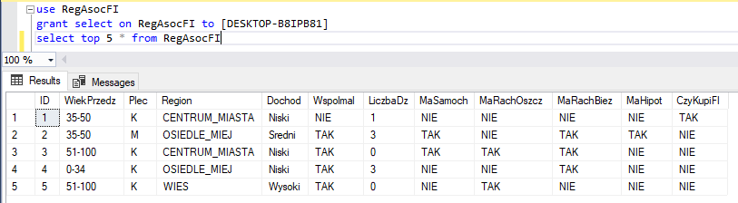
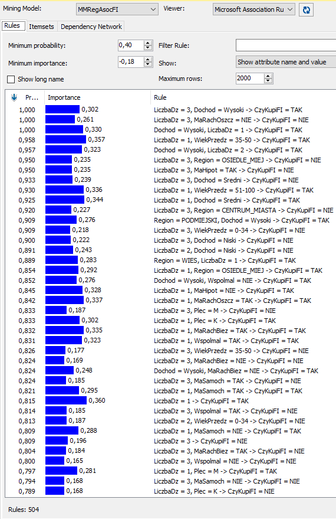
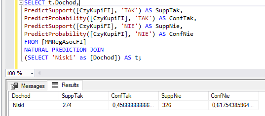
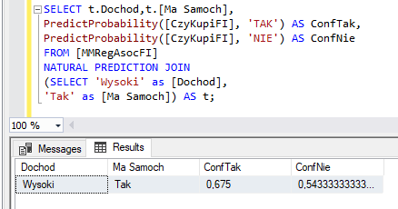
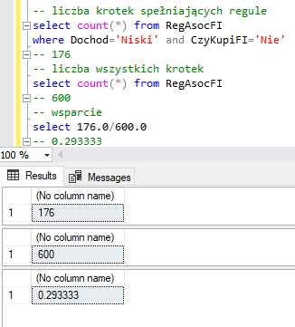
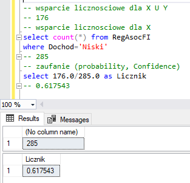
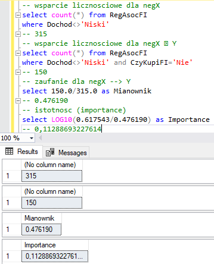

```{r setup, include=FALSE}
knitr::opts_chunk$set(echo = TRUE)
library("arules")
library(arulesViz)
```

# Reguły asocjacyjne

## Wczytanie danych
Przed rozpoczęciem tworzenia reguł asocjacyjnych należy wczytać dane. Następnie dane należy przekonwertować. Kolumnę LiczbaDz należy zamienić na typ "factor", na sam koniec zbiór danych zamieniono na typ "transactions" oraz pominięto nagłówek.

``` {r load_data, eval = TRUE}
data <- read.table(file = "RegAsocFI.csv", sep=",", header=TRUE)
head(data)
summary(data)
data$LiczbaDz <- as.factor(data$LiczbaDz)
data <- as(data[-1], "transactions")
```

## Reguła asocjacyjne w R
Do wyznaczenia reguł wykorzystano funkcję "apriori" wraz z parametrami gdzie "support" wynosi 0.001 "confidence" 0.5 natomiast maksymalną długość reguły na 3.

Top 5 reguł dla osób, które kupują fundusz inwestycyjny (confidence pondad 90%):

* Dochod=Wysoki LiczbaDzieci=3
* Dochod=Wysoki LiczbaDzieci=1
* WiekPrzedz=35-50 LiczbaDzieci=1 
* Dochod=Wysoki LiczbaDzieci=2
* WiekPrzedz=51-100 LiczbaDzieci=1

``` {r rules, eval = TRUE}
rules <- apriori(data, parameter = list(supp = 0.001, conf = 0.5, maxlen=3), appearance = list (default="lhs",rhs="CzyKupiFI=TAK"))
plot(rules)

rules_conf <- sort (rules, by="confidence", decreasing=TRUE)
inspect(rules_conf)

plot(head(sort(rules, by="lift"), 10),  method="graph", control=list(cex=.7))
```

## DMX













