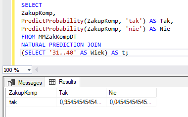
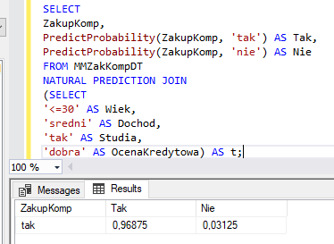
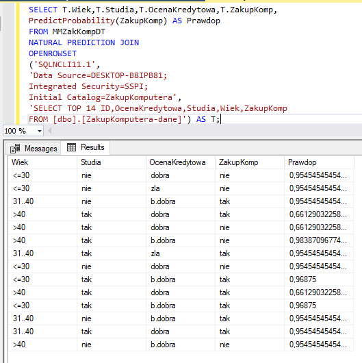
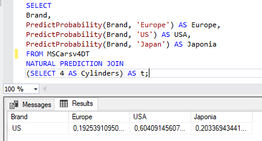
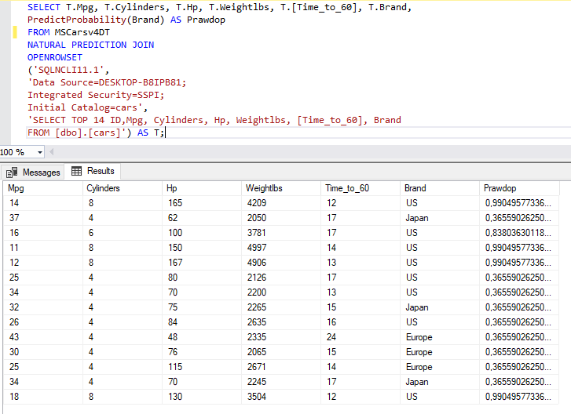

```{r setup, include=FALSE}
knitr::opts_chunk$set(echo = TRUE)
library(rpart)
library(e1071)
library(caret)
library(rpart.plot)
```

# Zakup komputera

## Wczytanie danych

``` {r load_data, eval = TRUE}
computers_data <- read.table(file = "ZakupKomputera-dane.csv", sep=",", header=TRUE)
head(computers_data)
summary(computers_data)
```

## Drzewa decyzjne

``` {r decison_tree, eval = TRUE}
trees <- rpart(ZakupKomp~Wiek+Dochod+Studia+OcenaKredytowa, data=computers_data)
trees
rpart.plot(trees)
```

## Bayes

``` {r naive_bayes, eval = TRUE}
smp_size <- floor(0.75 * nrow(computers_data))

set.seed(123)
train_ind <- sample(seq_len(nrow(computers_data)), size = smp_size)

train <- computers_data[train_ind, ]
test <- computers_data[-train_ind, ]

nb <- naiveBayes(ZakupKomp~Wiek+Dochod+Studia+OcenaKredytowa,data=train)
nb

x_test <- test[,2:5]
y_test <- test[,6]
predictions <- predict(nb, x_test)
confusionMatrix(predictions, y_test)
```

##DTX






# Klasyfikacja samochodów

## Wczytanie danych

``` {r load_data_cars, eval = TRUE}
cars_data <- read.table(file = "cars.csv", sep=",", header=TRUE)
head(cars_data)
summary(cars_data)
```


## Drzewa decyzjne

``` {r decison_tree_cars, eval = TRUE}
trees <- rpart(brand~., data=cars_data)
trees
rpart.plot(trees)
```

## Bayes

``` {r naive_bayes_cars, eval = TRUE}
smp_size <- floor(0.75 * nrow(cars_data))

set.seed(123)
train_ind <- sample(seq_len(nrow(cars_data)), size = smp_size)

train <- cars_data[train_ind, ]
test <- cars_data[-train_ind, ]

nb <- naiveBayes(brand~.,data=train)
nb

x_test <- test[,1:7]
y_test <- test[,8]
predictions <- predict(nb, x_test)
confusionMatrix(predictions, y_test)
```

##DTX



